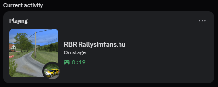

# RSFDiscordRPC

`RSFDiscordRPC` is a Richard Burns Rally / RallySimFans.hu plugin that publishes the current game activity to Discord Rich Presence.

This repository also contains the website and the public stage/car images used by the Rich Presence payload.

## What It Shows

- In the menus
- On stage
- Watching a replay

When possible, the plugin also resolves the current car and stage names and publishes matching images.

## Runtime Config

The packaged config file is [src/config/RSFDiscordRPC.ini](src/config/RSFDiscordRPC.ini).

- `UpdateIntervalMs`: refresh interval for Discord presence updates
- `IncognitoMode`: hides session details and publishes a minimal presence
- `DebugLogging`: enables or disables plugin debug logging

## Installation

Extract the release zip into the game's `Plugins` folder, then enable `RSFDiscordRPC` in the RallySimFans launcher before starting the game.

## Website

`web/` contains the presentation site and the public static images used by Discord Rich Presence.
The site is hosted on Cloudflare Workers and is available at [rsfdiscordrpc.loicrey.com](https://rsfdiscordrpc.loicrey.com/).
It also serves the stage and car image URLs used by the plugin because Discord only allows 300 application assets.
Car and stage image URLs are handled by the Worker, fetched from RallySimFans, center-cropped, upscaled to `512x512`, encoded as JPEG, and cached by Cloudflare.
Other public assets are served from `web/assets/`.

## About This Project

This project was also a learning project for me. It was more or less my first real C++ project, my first RSF/RBR plugin, and my first Win32 DLL project built with Visual Studio and AI tools.

Huge thanks to [NGPCarMenu](https://github.com/mika-n/NGPCarMenu) and [RBRCountdown](https://github.com/helloimhana123/RBRCountdown) for being open source, and thanks as well to AI tools and agents for helping me understand the plugin structure, the Windows/DLL side, and how game data can be read from memory.

## Contributing

For build steps, local setup, repository layout, and contribution details, see [CONTRIBUTING.md](CONTRIBUTING.md).
